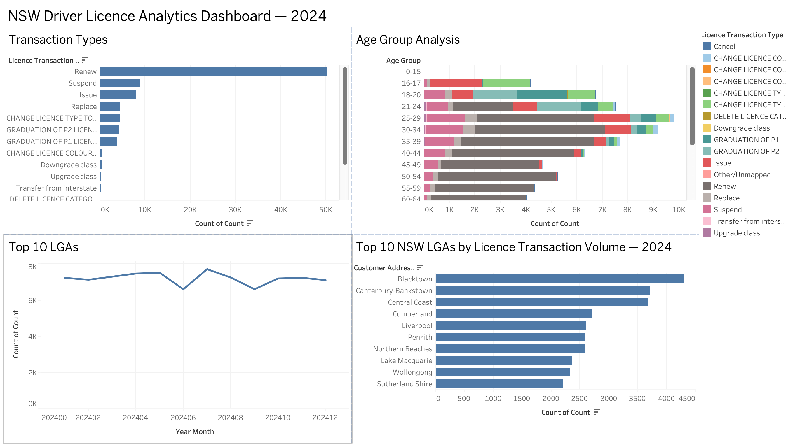
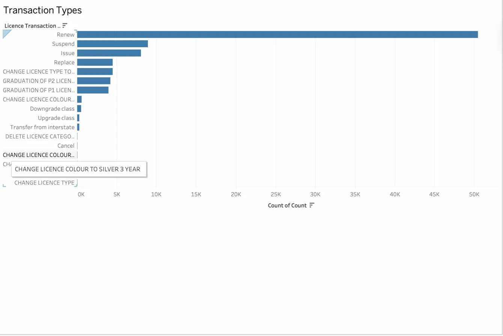
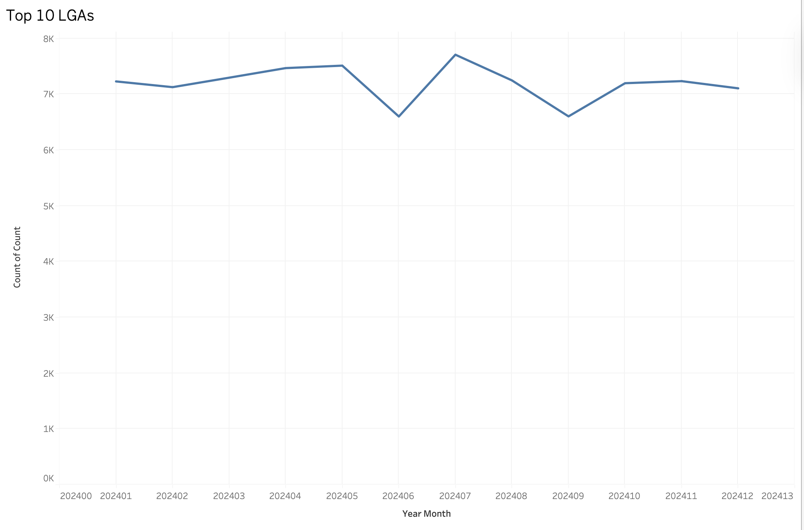
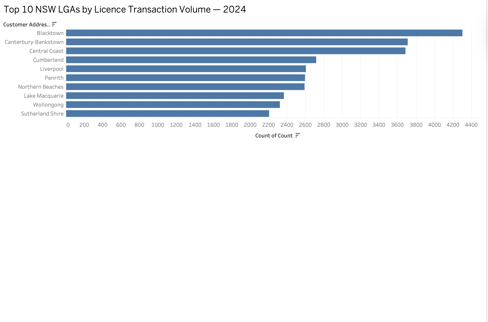

# Nsw-licence-dashboard
NSW Driver Licence Analytics Dashboard built with Python and Tableau Public

# NSW Driver Licence Analytics Dashboard — 2024

## Business Question
How are NSW driver licence transactions trending across 2024,
and where are the key pressure points for service delivery?

## Live Dashboard
👉 [View on Tableau Public](https://public.tableau.com/views/NSW-Driver-Licence-Analytics-2024/Dashboard1)

## Dashboard Preview
![Dashboard Overview]
# NSW Driver Licence Analytics Dashboard — 2024

## Business Question
How are NSW driver licence transactions trending across 2024,
and where are the key pressure points for service delivery?

## Live Dashboard
👉 [View on Tableau Public](https://public.tableau.com/views/NSW-Driver-Licence-Analytics-2024/Dashboard1)

## Dashboard Preview

## Key Findings
- **Renewals dominate** transaction volume, representing the 
  majority of all NSW licence activity in 2024
- **Blacktown LGA** generates the highest transaction volume 
  in NSW, followed by Canterbury-Bankstown and Central Coast
- **Transaction volumes dip in June and September**, suggesting 
  seasonal patterns Service NSW could use for staffing planning
- The **25–34 age group** drives the highest overall volume, 
  while 16–20 year olds show distinct P1/P2 graduation patterns

## Data Source
Transport for NSW Open Data — Driver Licence Statistics
[opendata.transport.nsw.gov.au](https://opendata.transport.nsw.gov.au)

## Key Findings
- **Renewals dominate** transaction volume, representing the 
  majority of all NSW licence activity in 2024
- **Blacktown LGA** generates the highest transaction volume 
  in NSW, followed by Canterbury-Bankstown and Central Coast
- **Transaction volumes dip in June and September**, suggesting 
  seasonal patterns Service NSW could use for staffing planning
- The **25–34 age group** drives the highest overall volume, 
  while 16–20 year olds show distinct P1/P2 graduation patterns

## Visuals

### 1. Transaction Types

Licence renewals dominate NSW driver licence transactions in 2024, accounting for the vast majority of volume. This suggests Service NSW should prioritise renewal workflow efficiency over processing capacity for new licence types.

### 2. Age Group Analysis

The 25–34 age group drives the highest licence transaction volume in NSW, with renewals dominating across all age groups. Notably, 16–20 year olds show a distinct pattern of P1 and P2 graduation transactions, reflecting the structured progression of young drivers through the NSW licensing system. Suspension transactions are concentrated in the 25–44 working-age bracket, suggesting targeted intervention programs in this group could reduce reprocessing demand on Service NSW centres

### 3. Monthly Trend

NSW driver licence transaction volumes remained broadly stable throughout 2024, averaging around 7,000 transactions per month. Notable dips in June and September suggest seasonal demand reduction, potentially linked to school holiday periods or public holiday clusters. Service NSW could use this pattern to plan staffing and resource allocation more efficiently across the calendar year

### 4. Top 10 LGAs

Blacktown LGA generates the highest driver licence transaction volume in NSW, nearly 20% above the next highest LGAs of Canterbury-Bankstown and Central Coast. The top 10 LGAs are dominated by Western Sydney councils, reflecting population density and growth corridors. These insights could inform Service NSW's decisions around service centre resourcing, digital channel investment, and mobile service deployment in high-demand areas.

## Tools & Methodology
- **Python (Pandas)** — combined 12 monthly CSV files into one 
  clean dataset of 1,057,212 rows
- **Tableau Public** — built 4 interactive visualisations 
  combined into a single dashboard

## Data Source
Transport for NSW Open Data — Driver Licence Statistics
[opendata.transport.nsw.gov.au](https://opendata.transport.nsw.gov.au)
